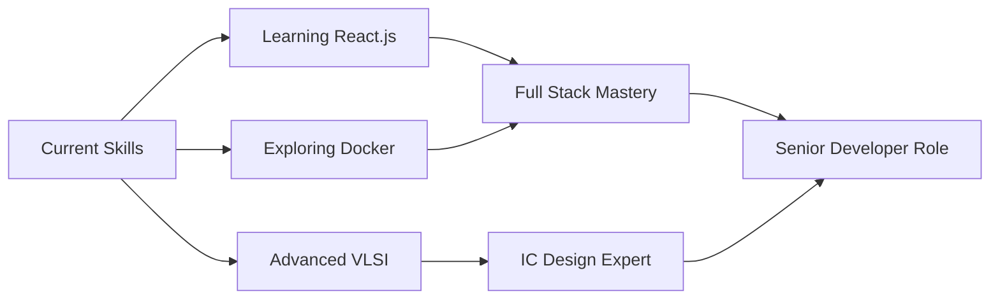

# 👋 Hi there, I'm Ramana KS

<div align="center">
  
  <!-- Animated Header Wave -->
  
  
  <!-- Dynamic Typing Animation -->
  <a href="https://git.io/typing-svg">
    
  </a>
  
  <br>
  
  <!-- Animated Badges -->
  <a href="mailto:ksramana2011@gmail.com">
    
  </a>
  <a href="https://linkedin.com/in/ramana-ks">
    
  </a>
  <a href="https://github.com/RamanaKS">
    
  </a>
  
  <br><br>
  
  <!-- Profile Views Counter with Animation -->
  
  
  
</div>

<br>

---

## 🎯 About Me

```python
class RamanaKS:
    def __init__(self):
        self.username = "Ramana KS"
        self.role = "Full Stack Developer | VLSI Engineer"
        self.location = "Chennai,Tamilnadu, 🇮🇳"
        self.current_focus = ["Django REST APIs", "Low-Power Circuit Design"]
        self.languages = ["Python", "JavaScript", "HTML/CSS", "SQL"]
        
    def say_hi(self):
        print("Thanks for visiting! Let's build something amazing together! 🚀")

me = RamanaKS()
me.say_hi()
```

<details>
<summary><b>🎓 Click to expand my journey</b></summary>
<br>

- 🎓 B.Tech in **Electronics and Communication Engineering**
- 💼 Passionate about building **scalable web applications** and **energy-efficient hardware**
- 🌱 Currently learning **React.js** and **Advanced Digital System Design**
- 💡 Always exploring the intersection of **software** and **hardware**
- ⚡ Fun fact: I believe every bug is just an undocumented feature! 🐛✨

</details>

---

<div align="center">

## 🛠️ Tech Stack & Arsenal

### 💻 Languages & Frameworks
  


<br>

### 🎨 Specialized Skills

<table>
  <tr>
    <td align="center" width="200">
      
      <br><b>Backend</b>
      <br>Django, REST APIs, MySQL
    </td>
    <td align="center" width="200">
      
      <br><b>Frontend</b>
      <br>HTML, CSS, JavaScript, Bootstrap
    </td>
    <td align="center" width="200">
      
      <br><b>VLSI Design</b>
      <br>CMOS, PTL, Low-Power Design
    </td>
    <td align="center" width="200">
      
      <br><b>Version Control</b>
      <br>Git, GitHub, Collaboration
    </td>
  </tr>
</table>

</div>

---

## 🎨 Featured Projects

<div align="center">

### 🌟 Hover over cards to see details! 🌟

</div>

<table>
  <tr>
    <td width="50%" valign="top">
      <div align="center">
        <h3>🏠 Home Service Booking System</h3>
        
        
        
      </div>
      <br>
      
**🎯 Problem Solved:**
> Connecting users with reliable local service providers in a secure, user-friendly platform.

**✨ Key Features:**
- 🔐 **RBAC Implementation** - Secure role-based access control
- 👥 **Multi-user Dashboard** - Admin, User, and Provider interfaces
- 🔍 **Smart Search & Filtering** - Find services instantly
- ⭐ **Rating & Review System** - Build trust through feedback
- 📱 **Responsive Design** - Works seamlessly on all devices

**🚀 Tech Highlights:**
```python
# Django REST API endpoint example
@api_view(['POST'])
def book_service(request):
    # Smart booking algorithm
    return Response({"status": "success"})
```

<div align="center">
        
[](#)
[](#)

</div>
    </td>
    <td width="50%" valign="top">
      <div align="center">
        <h3>⚡ Low-Power 4-bit ALU</h3>
        
        
        
      </div>
      <br>
      
**🎯 Problem Solved:**
> Reducing power consumption in arithmetic circuits for battery-powered devices.

**✨ Key Features:**
- ⚡ **60% Power Reduction** - Compared to standard CMOS
- 🔧 **Pass Transistor Logic** - Optimized circuit topology
- 📊 **4-bit Operations** - ADD, SUB, AND, OR, XOR, NOT
- 🎛️ **Low Transistor Count** - Minimized chip area
- 🌡️ **Thermal Efficiency** - Reduced heat dissipation

**🔬 Technical Specs:**
```verilog
// ALU Operations
- Addition/Subtraction
- Logical Operations (AND, OR, XOR)
- Power: ~45% less than CMOS
- Delay: Optimized propagation time
```

<div align="center">
        
[](#)
[](#)

</div>
    </td>
  </tr>
</table>

---

## 📊 GitHub Analytics & Activity
## 📊 GitHub Stats

<div align="center">


</div>
---
## 🎯 Current Goals & Learning Path

<div align="center">



</div>

**🎯 2025 Roadmap:**
- [ ] 🚀 Master React.js and build 3 full-stack projects
- [ ] 📦 Learn Docker & Kubernetes for deployment
- [ ] 🔬 Complete advanced VLSI certification
- [ ] 📝 Contribute to 5 open-source projects
- [ ] 💼 Land a senior developer role
- [ ] ✍️ Write technical blogs and tutorials

---

## 💡 Random Dev Quote

<div align="center">


</div>

---

## 🤝 Let's Connect & Collaborate!

<div align="center">

**Open to opportunities in Web Development, VLSI Design, and exciting collaborations!**

<br>

<a href="mailto:ksramana2011@gmail.com">
  
</a>
<a href="https://linkedin.com/in/ramana-ks">
  
</a>
<a href="https://github.com/RamanaKS">
  
</a>

<br><br>

### 💬 Feel free to reach out for:
**Web Development Projects** • **VLSI Collaborations** • **Open Source Contributions** • **Tech Discussions** • **Freelance Opportunities**

<br>

**⭐ If you like my work, consider starring my repositories!**

</div>

---

<div align="center">
  
### 🎵 *"First, solve the problem. Then, write the code."* – John Johnson


**Made with ❤️ and lots of ☕ by Ramana KS**

<div align="center">
  
</div>
```


